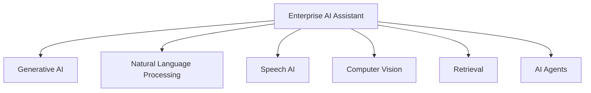

# AI Capability Map

## Purpose

This document maps the major AI capabilities that may become part of the
Secure Enterprise AI Assistant to practical enterprise use cases.

The purpose is to distinguish the role of each technology before specific
Azure services are selected.

## Capability Map



## Enterprise Use Cases

| Capability | Primary Purpose | Enterprise Use Case |
|---|---|---|
| Generative AI | Generate or transform content | Explain technical documentation and generate grounded answers |
| Natural Language Processing | Analyze and extract meaning from text | Detect entities, sentiment, keywords, and classifications in enterprise text |
| Speech AI | Convert between spoken language and text | Allow field personnel to speak questions and receive spoken responses |
| Computer Vision | Analyze images and visual information | Interpret equipment images, diagrams, screenshots, or visual documentation |
| Retrieval | Locate relevant information from approved sources | Find company procedures and technical documentation before generating an answer |
| AI Agents | Reason about goals and use approved tools | Create an authorized support ticket or perform another explicitly approved workflow |

## How the Capabilities Work Together

These technologies are not mutually exclusive.

A future employee request could involve several capabilities:

```text
Employee speaks a question
        |
        v
Speech Recognition
        |
        v
Natural Language / Generative AI
        |
        v
Enterprise Retrieval
        |
        v
Generative AI Response
        |
        v
Speech Synthesis
```

An agent adds another capability when the request requires an action:

```text
Employee Request
        |
        v
AI Agent
        |
        +----> Retrieve Enterprise Information
        |
        +----> Reason About the Request
        |
        +----> Select an Approved Tool
        |
        +----> Verify Authorization
        |
        +----> Request Approval When Required
        |
        +----> Perform the Approved Action
```

## Capability Distinctions

### Generative AI

Generative AI creates new content such as explanations, summaries,
responses, or other generated output.

### Natural Language Processing

NLP analyzes language to extract or classify information such as entities,
sentiment, keywords, or meaning.

Large language models can perform many NLP tasks, so NLP and generative AI
are overlapping capabilities rather than completely separate technologies.

### Speech AI

Speech AI handles spoken language.

Speech recognition converts speech to text.

Speech synthesis converts text to speech.

### Computer Vision

Computer vision analyzes visual information such as photographs, diagrams,
screenshots, and video frames.

### Retrieval

Retrieval locates relevant information from an approved source.

Retrieval does not generate the answer. It supplies relevant information
that another component, such as a generative AI model, can use.

### AI Agents

An AI agent works toward a goal by reasoning about steps and using
available tools.

An agent may use generative AI, NLP, retrieval, vision, and speech as
supporting capabilities.

The ability to use a tool does not automatically grant the agent authority
to execute an action.

## Current Project Scope

During Week 2, these capabilities are being mapped conceptually.

No production AI service, autonomous agent, or enterprise data connection
has been implemented yet.