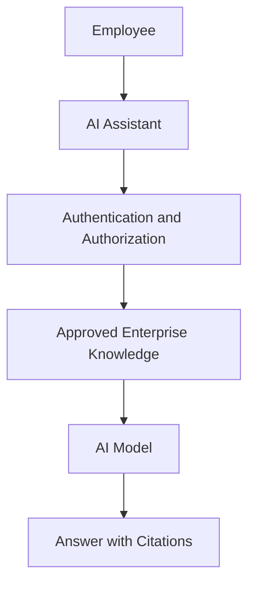

# Initial Architecture Concept

## Purpose

The Secure Enterprise AI Assistant will help employees find and understand approved enterprise information.

The assistant will search approved company information, generate an answer based on that information, and provide citations showing where the answer came from.

Future versions will also support explicitly authorized actions through AI agents.

## Initial Architecture

## Initial Workflow

1. An employee asks a question.
2. The system verifies the employee's identity and permissions.
3. The assistant searches approved enterprise information.
4. Relevant information is provided to the AI model.
5. The AI model generates an answer.
6. The answer is returned with citations.

## Security Principle

The AI assistant must never have more authority than the authenticated user.

Access to information does not automatically grant permission to change systems or data.

## Autonomous Action Restrictions

The AI assistant will not autonomously:

- Delete enterprise data.
- Modify production systems.
- Change user permissions.
- Change network or firewall configurations.
- Install software.
- Execute arbitrary operating-system commands.
- Send external communications.
- Perform financial transactions.
- Access information outside the user's permissions.

High-impact actions will require explicit authorization.

## Future Direction

Later versions of the project will add AI agents and approved tools.

Before an agent performs an action, the system will verify authorization and require human approval when appropriate.

## Week 1 Status

This document represents the initial concept only.

The architecture will be expanded as the project progresses and new AI, retrieval, security, and agent concepts are learned.
